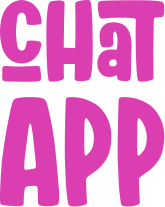
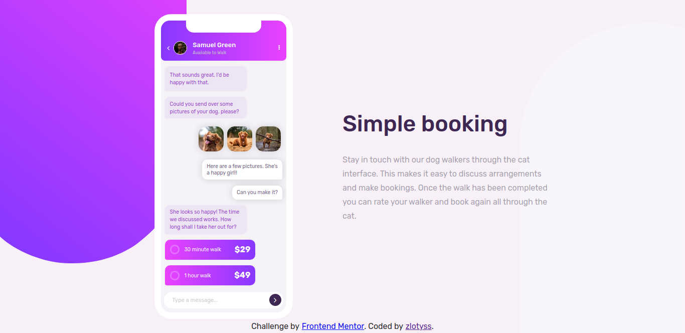

<p align="center">
  
</p>

<p align="center">
  Desafio de reproduzir um site com um Chat App.
</p>

<p align="center">  
  
</p>

<p align="center">
  
</p>

## Tabela de conteúdos
   * [Sobre](#Sobre)
   * [Como usar](#como-usar)
   * [Tecnologias](#tecnologias)
   * [Como Contribuir](#contribuir)
   * [Licença](#licença)
   
<h2 id="Sobre">Sobre o Projeto</h2>
O objetivo do desafio é chegar mais próximo o possivel do design proposto pelo desafio no <a href="https://www.frontendmentor.io/">Frontend Mentor</a> <br />
projeto feito para fixar os conhecimentos e melhorar as habilidades com desenvolvimento web.

<h2 id="como-usar">Como Utilizar</h2>

```bash
# Clone este repositório
$ git clone <https://github.com/vduggen/Chat-App>

# Acesse a pasta do projeto no terminal/cmd
$ cd Chat-App

# Vá para a pasta dist
$ cd dist

$ Abra no navegador o arquivo index.html
```

<h2 id="tecnologias">Tecnologias</h2>

As seguintes ferramentas foram usadas na construção do projeto:

- [HTML](https://developer.mozilla.org/pt-BR/docs/Web/HTML)
- [Sass](https://sass-lang.com/)

<h2 id="contribuir">Como contribuir</h2>

1. Faça um fork desse repositório;
1. Cria uma branch com a sua feature: `git checkout -b minha-feature`;
1. Faça commit das suas alterações: `git commit -m 'feat: Minha nova feature'`;
1. Faça push para a sua branch: `git push origin minha-feature`.

Depois que o merge da sua pull request for feito, você pode deletar a sua branch.

<h2 id="licença">Licença</h2>

Esse projeto está sob a licença MIT. Veja o arquivo [LICENSE](LICENSE.md) para mais detalhes.

